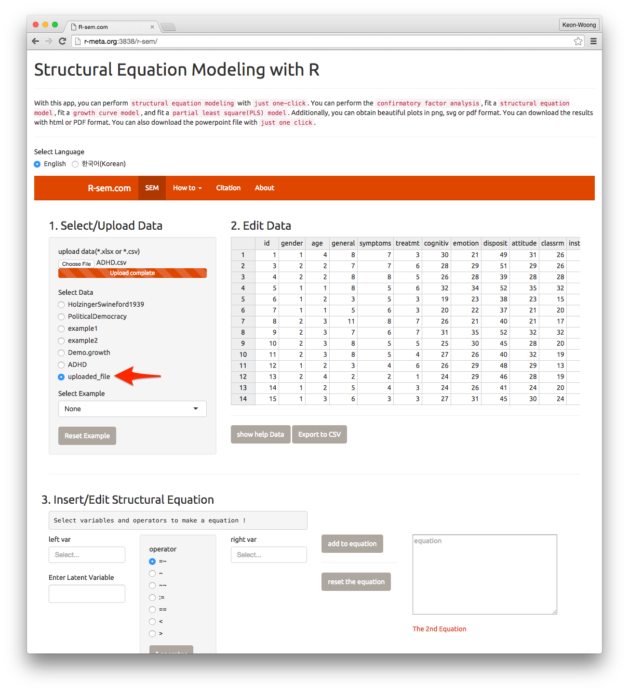
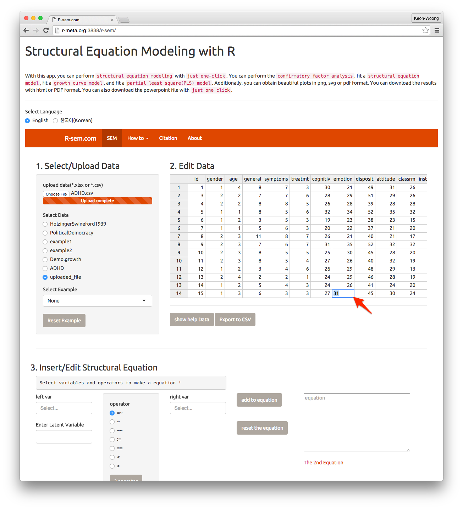
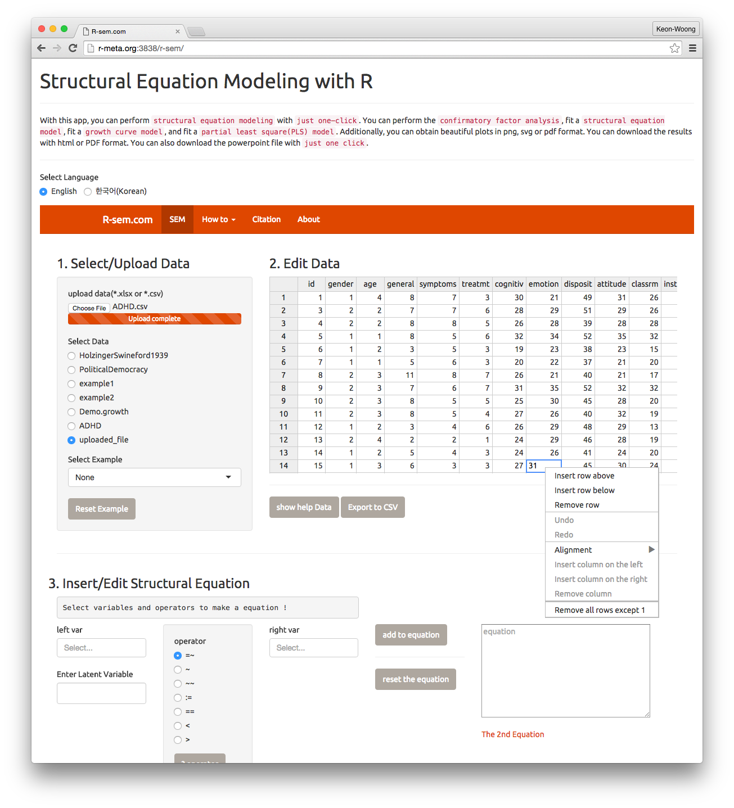

# Analyze Your Own Data

In this chapter, I will discuss how to upload your own data to the `Structural Equation Modeling(SEM) with R` app and edit the data. 

## Upload data

You can upload your own data by clicking the `choose file` button(1). In the popup window, you can select your own data file(2). A data file with Microsoft excel format(\*.xlsx) or comma-separate value format(\*.csv) is allowed. Because an excel file contains calculations, functions or macros may cause error, the \*.csv format is preferred. You can save an excel file with a \*.csv format by "save as..." menu on excel. The limitation of file size is 30 MB. After selection of you data file, press `choose` button(3). 

After a few seconds, the upload completed.You should select the uploaded_file(1) among the `Select Data` radio buttons. Your file is displayed at `Edit Data` window.

## Edit data

You can edit your data by click a cell in the table. You can use your data table as a spreadsheet.

## Insert/remove row

By right click the table, you can insert row or remove row.

