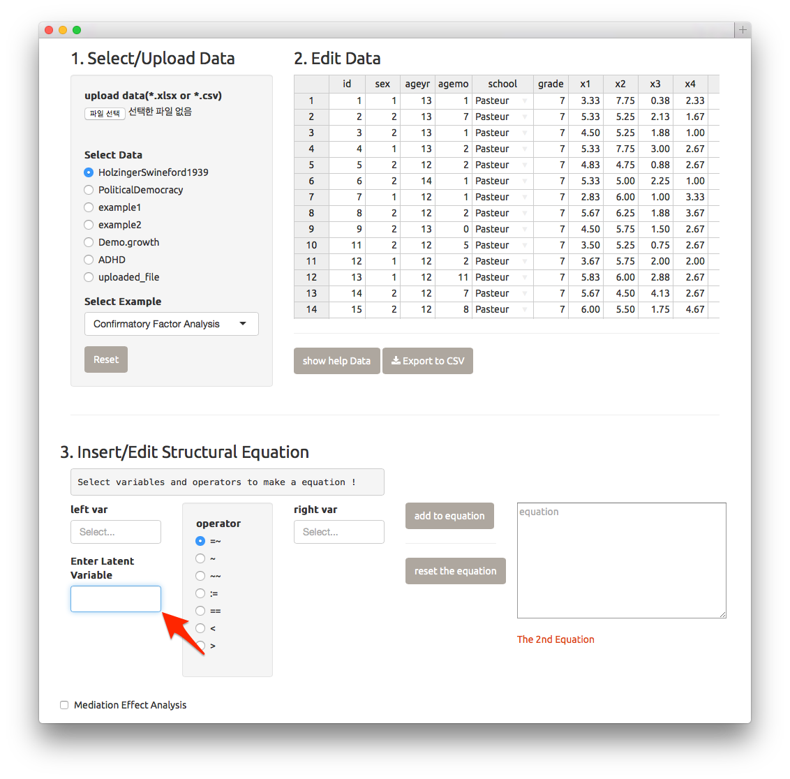
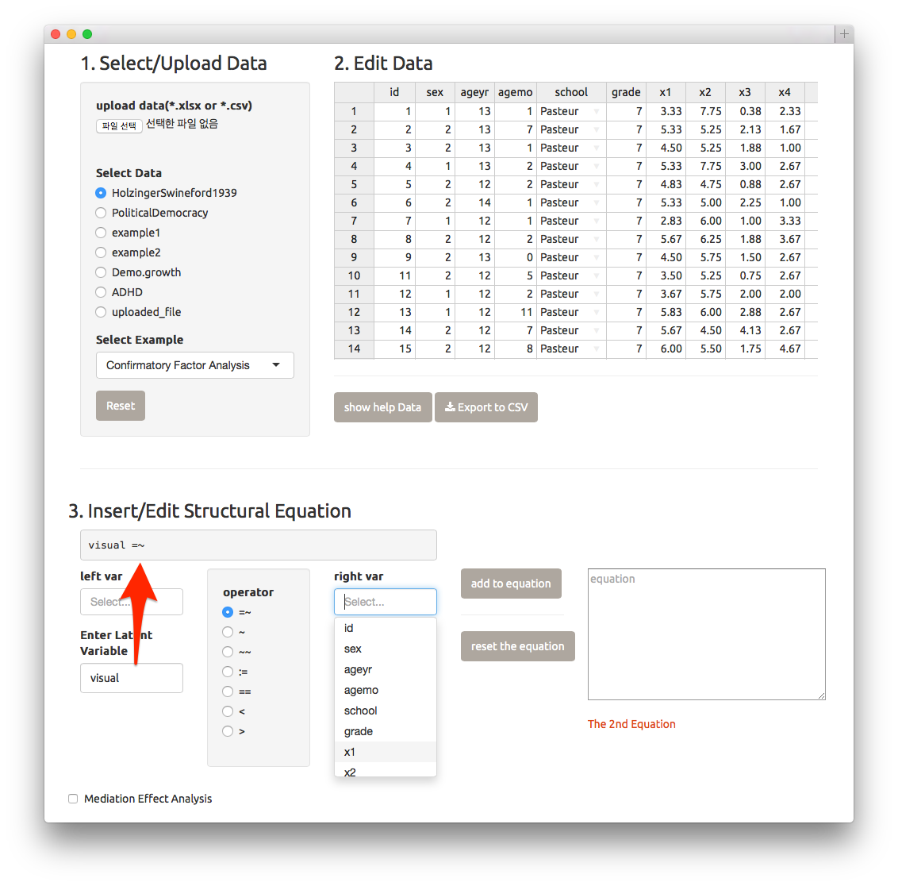
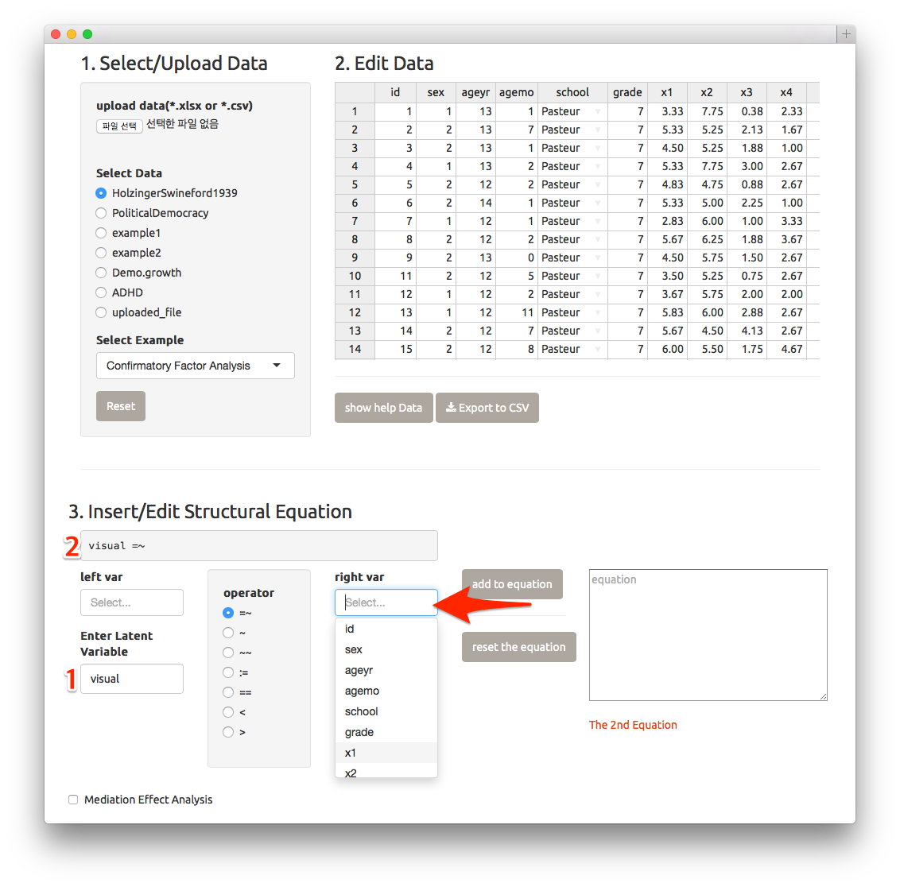
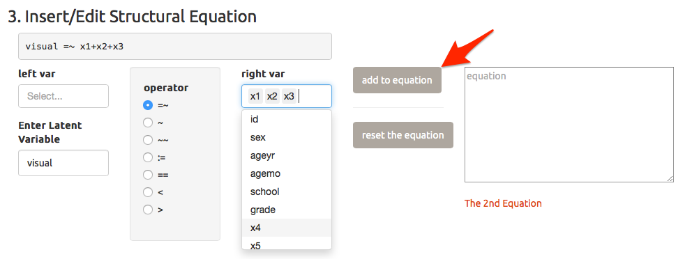
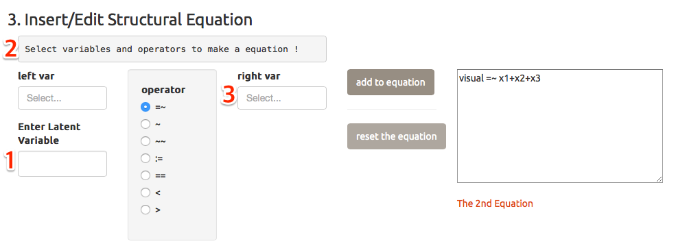
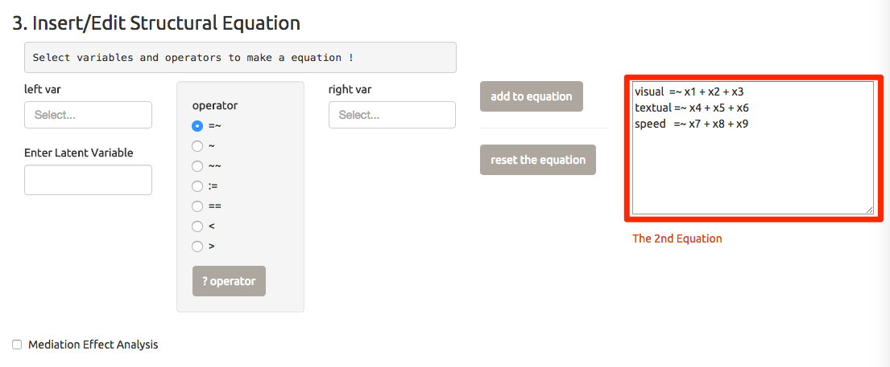

# Insert/Edit Structural Equation  

The classic Holzinger and Swineford (1939) dataset consists of mental ability test scores of seventh- and eighth-grade children from two different schools (Pasteur and Grant-White). In the original dataset (available in the MBESS package), there are scores for 26 tests. However, a smaller subset with 9 variables is more widely used in the literature. A Confirmatory Factor Analysis(CFA) model that is often proposed for these 9 variables consists of three latent variables (or factors), each with three indicators:

* a `visual` factor measured by 3 variables: x1, x2 and x3
* a `textual` factor measured by 3 variables: x4, x5 and x6
* a `speed` factor measured by 3 variables: x7, x8 and x9

You can insert/edit the structural equation easily by the following steps. 

1. Choose left side variable(s) or enter the latent variable 
2. Select operator
3. Choose right side variable(s)

(1) First, please enter the latent variable `visual` in the text input(arrow). 

As you enter the latent variable `visual`, the left side of equation will be made and the operator `=~` will be added(arrow). The operator `=~` is used for latent variable definition which means `is measured by`. 

The current set of operators is summarized in the table below.

formula type              | operator | mnemonic
--------------------------|----------|------------
latent variable selection | `=~`     | is measured by
regression                | `~`      | is regressed on
(residual) (co)variance   | `~~`     | is correlated with
intercept                 | `~1`     | intercept
defined parameter         | `:=`     | is predefined as
equality constriant       | `==`     | equals
non-equalty constraint    | `<`      | is less than
non-equalty constraint    | `>`      | is greater than

(2) And then, please select the rigth side variables - `x1`,`x2` and `x3` - among the variables displayed in the selectInput.

(3) After selection of three variables, press the `add to equation` button.

The temporary equation just made will be added to the equation. The latent variable input box(1), temporary equation(2) and the selectInput(for rigth side variables) will be initialized.

Please repeat the step (1)-(3) to add the equation:

`textual =~ x4 + x5 + x6`

`speed =~ x7 + x8 + x9`

# Direct edit the equation

You can directly type the equation in the equation window just as a word processor. 

