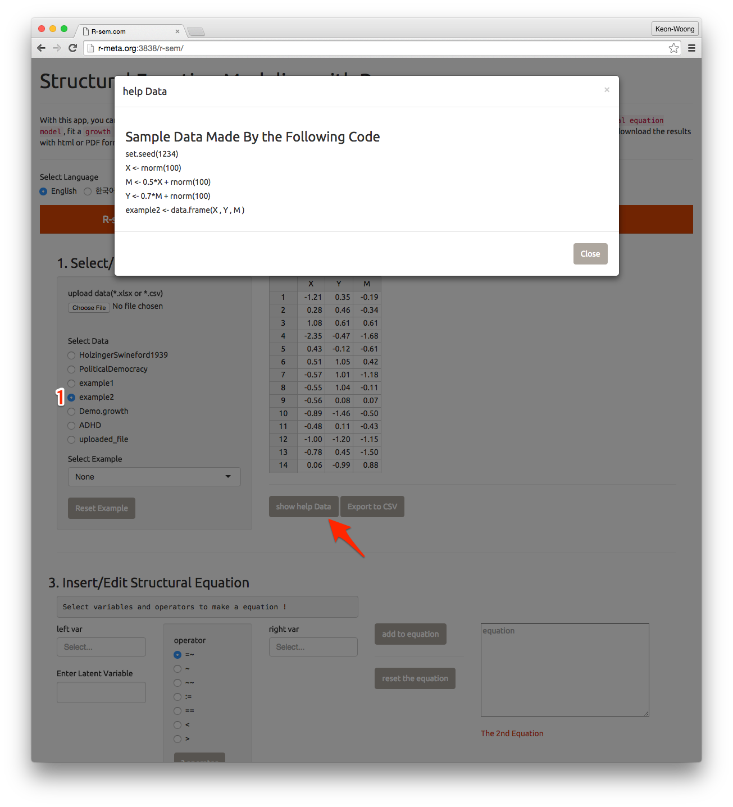
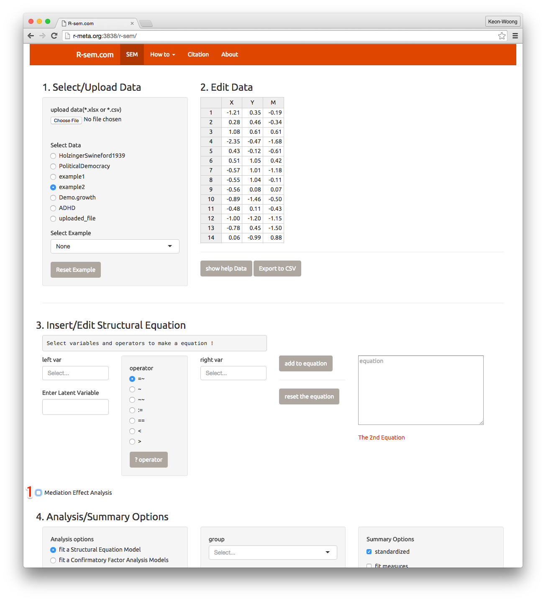
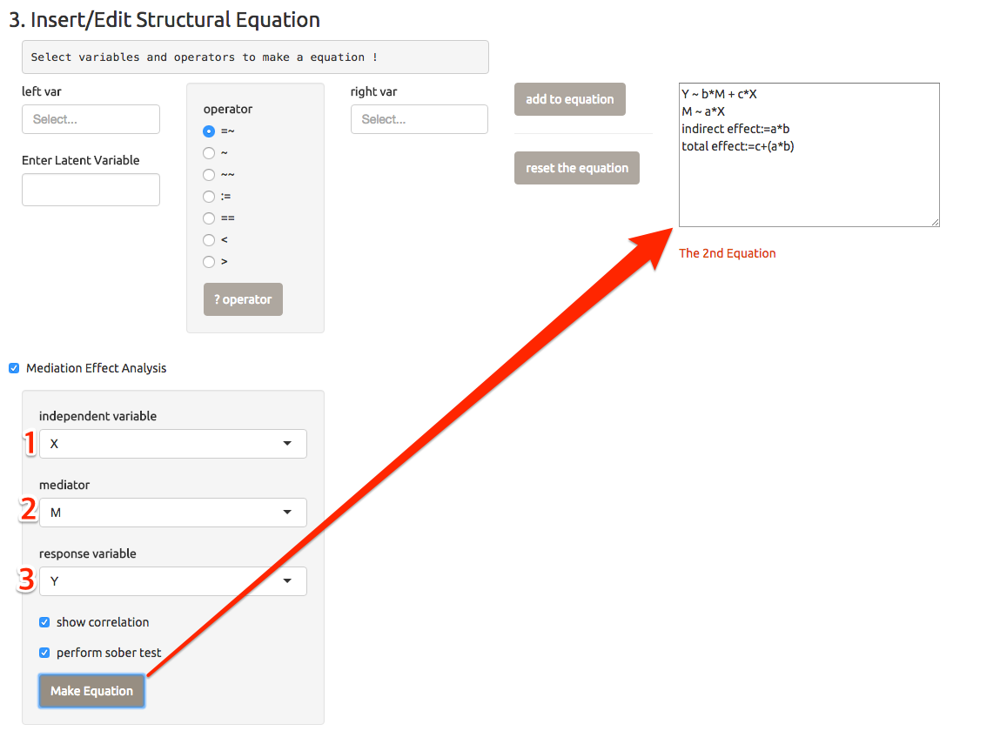
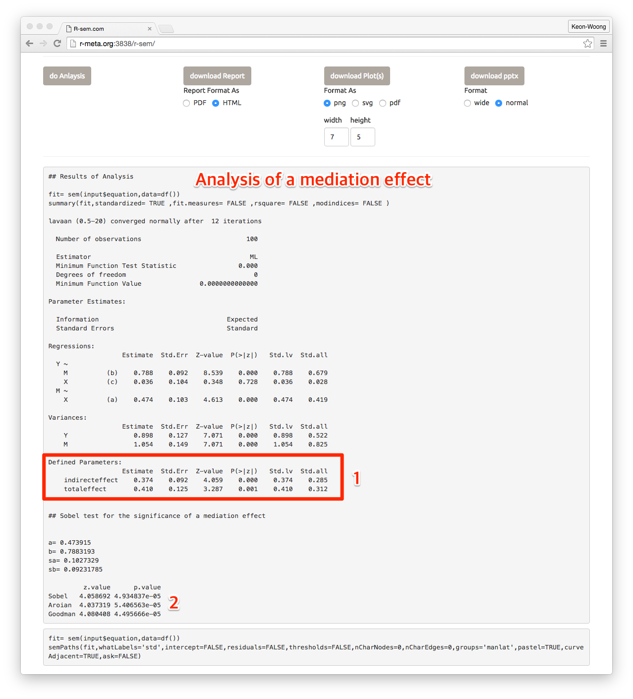
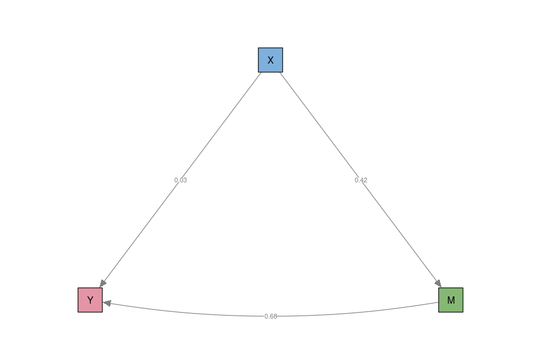

# Edit A Mediation Effect Equation

In this chapter, I will use the data and explanation described in lavaan homepage(http://lavaan.ugent.be/tutorial/mediation.html).

Consider a classical mediation setup with three variables: Y is the dependent variable, X is the predictor, and M is a mediator. For illustration, we create a toy dataset containing these three variables, and fit a path analysis model that includes the direct effect of X on Y and the indirect effect of X on Y via M.

Please select `example2` among the `select Data` radio buttons(1). If we wanted to konw how the data be made, just click the `show data Help` button(arrow).

## check the `Mediation Effect Analysis`

To insert the mediation effect easily, please select the `Mediation effect Analysis` checkbox(arrow).

## Select variables

Please select `X` as a independent variable, select ` M` as a mediator and select `Y` as a response variable. Press `Make Equation` button and you can get the mediation equation(arrow).  

Of course, you can type the equation directly in the `equation` textbox.  

## Do analysis

Press the `do Analysis` button and you can get the analysis result. You can can result of the total effect and indirect effect(1) as well as the result of so-called Sobel test for the mediation effect(2).
 

You can also get the plot for mediation effect.

