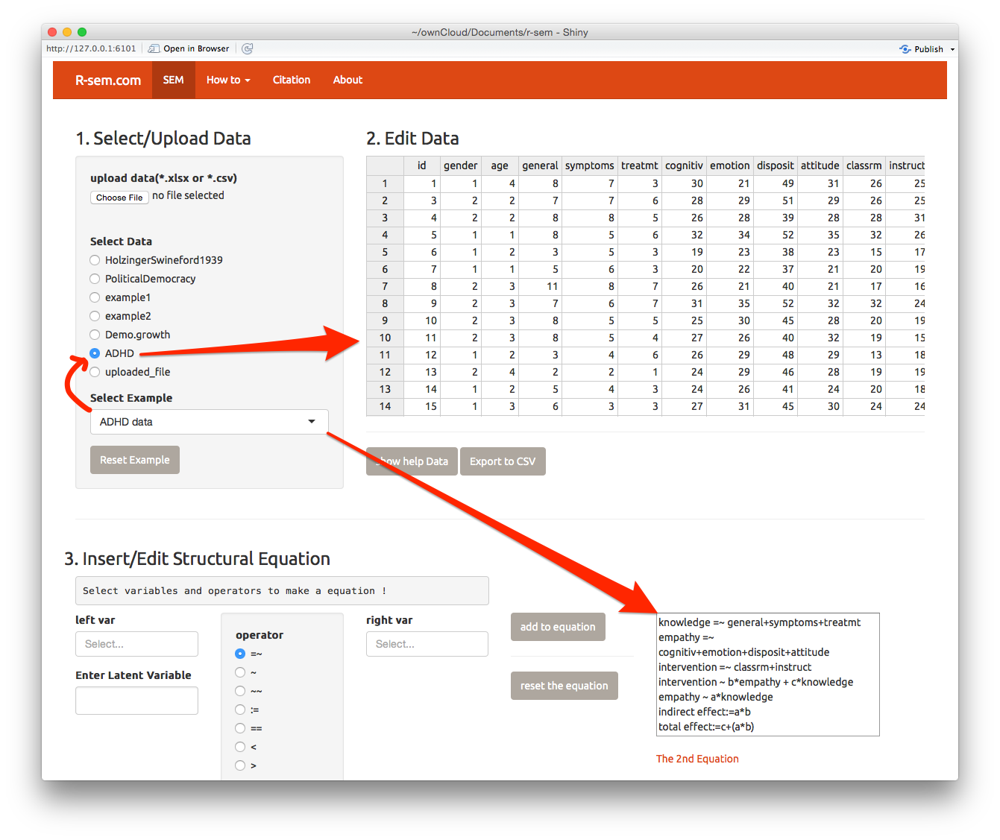
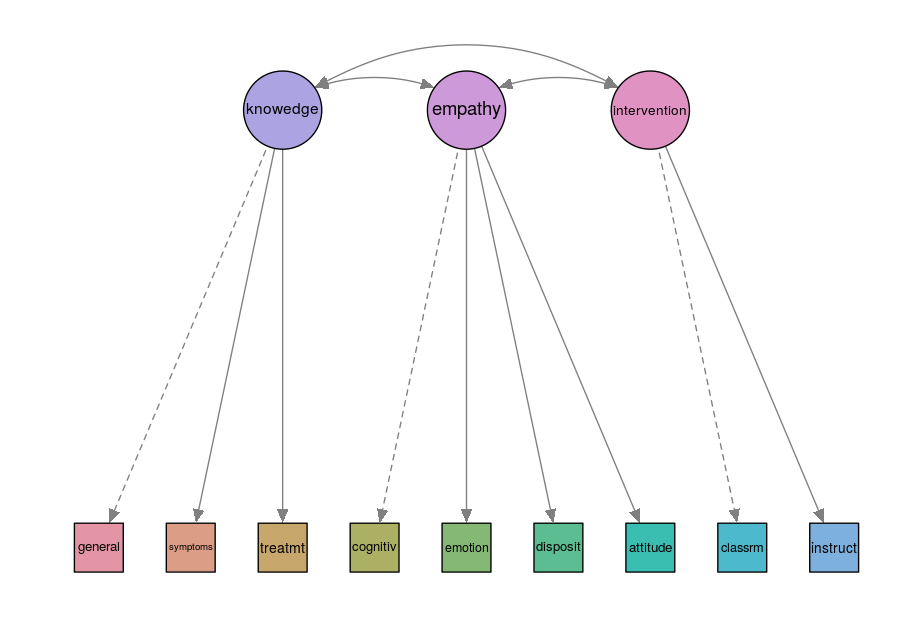
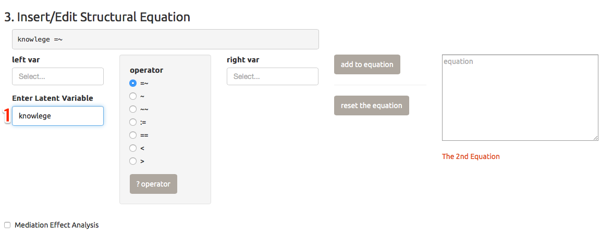
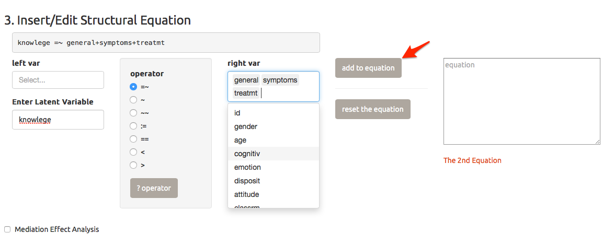
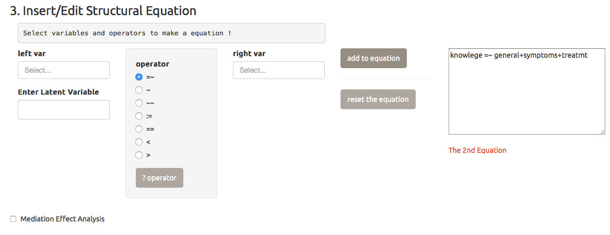
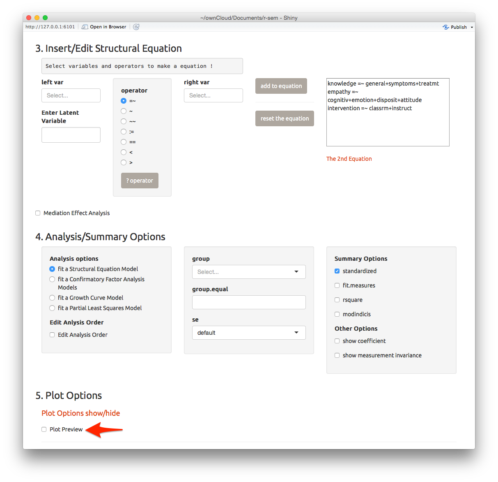
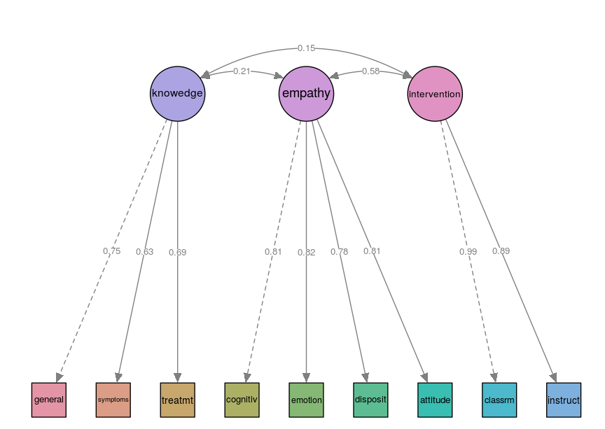
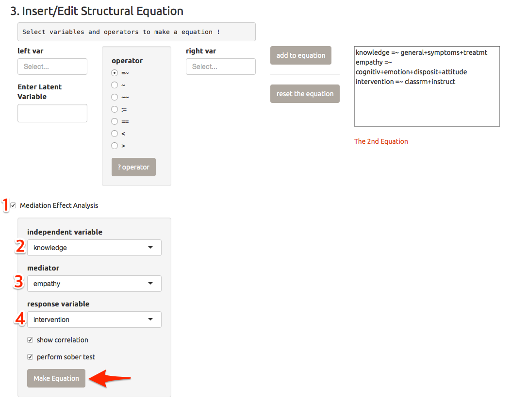
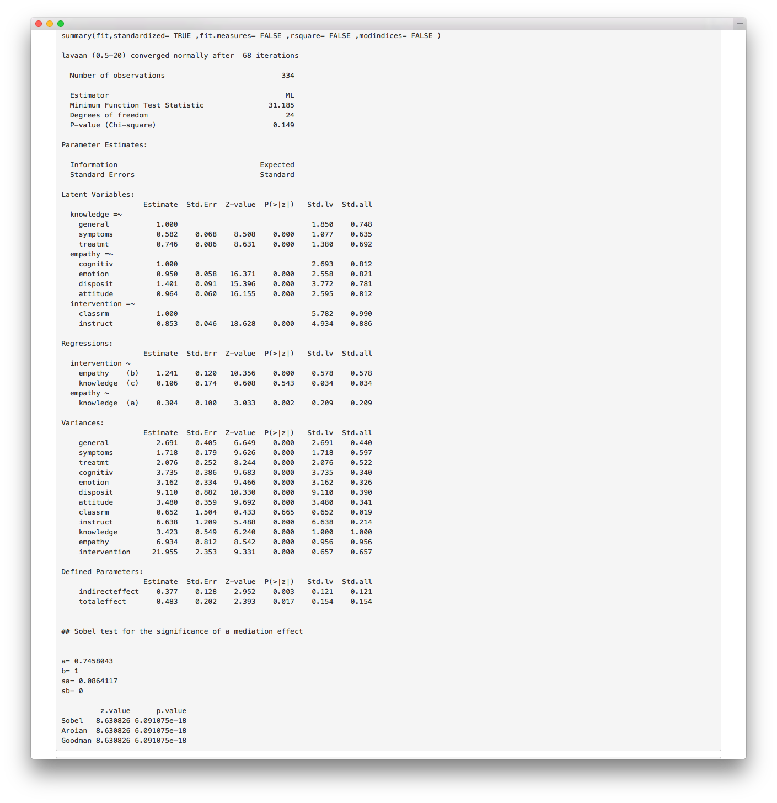
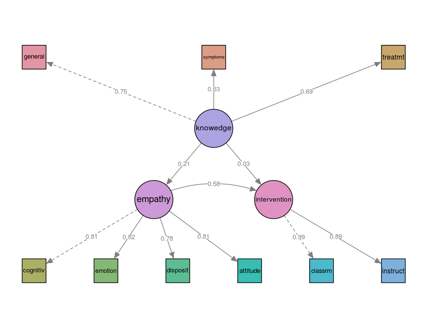

# A complete example

In this chapter, I will show the complete example using the ADHD data. This data is a dataset contains measures about the 334 teacher's knowlege, empathy and intervention about attention-deficit hyperactivity disorder(ADHD).The figure below contains a graphical representation of the model that we want to fit.


## Do it at once

You can finish the analysis using above model at once. Select `ADHA data` among `Select Example` select Input. By selecting the example, the data will be changed to `ADHD` and the equation will be made automatically(arrows).



Press the `do Analysis` button and you will be able to get the anlaysis results and plot. 

Press the `reset example` button to reset the equation. I will show you how to make the structural equations in this study.


## Step 1. Define latent variables 

First of all, let's start from defining the latent variables.




### Define the latent variable `knowledge`

Please type the `knowledge` in the `Enter latent variable` textbox. The operator `=~` will be added to the left variable.



Select the `general`,`symptoms` and `treatmt` among the `rigth var` select input. The right var(s) you selected is added to the temporary equation. Press the `add to equation` button(arrow).



The temporary equation is added to equation.



### Define latent variables - `empathy` and `intervention`

Please define the latent variable `empathy`. The `empathy` is measured by attitude, disposit, emotion and cognitiv. The `intervention` is measured by classrm and instruct.

```
empathy =~ cognitiv + emotion + disposit + attitude
intervention =~ classrm + instruct
```

After completion of defining the latent variables, the equation should be like as follows.



If you select the plot preview checkbox(arrow), you will be able to get the following plot. 



## Step 2. Define the mediation effect 

Please select the `Mediation Effect Analysis` checkbox(1). Select `knowledge` as the independent variable(2), select `empathy` as mediator(3) and select `intervention` as the response variable(4). Adn press the `Make Equation` button.   



The mediation effect equation will be aded to the equation. The final equation will be as follows.

```
knowledge =~ general+symptoms+treatmt
empathy =~ cognitiv+emotion+disposit+attitude
intervention =~ classrm+instruct

intervention ~ b*empathy + c*knowledge
empathy ~ a*knowledge
indirect effect:=a*b
total effect:=c+(a*b)
```

By press the `do Analysis` button, you will get the results of analysis as well as the following plot.




To customize your plot, please read the `customize you plot` chapter.


