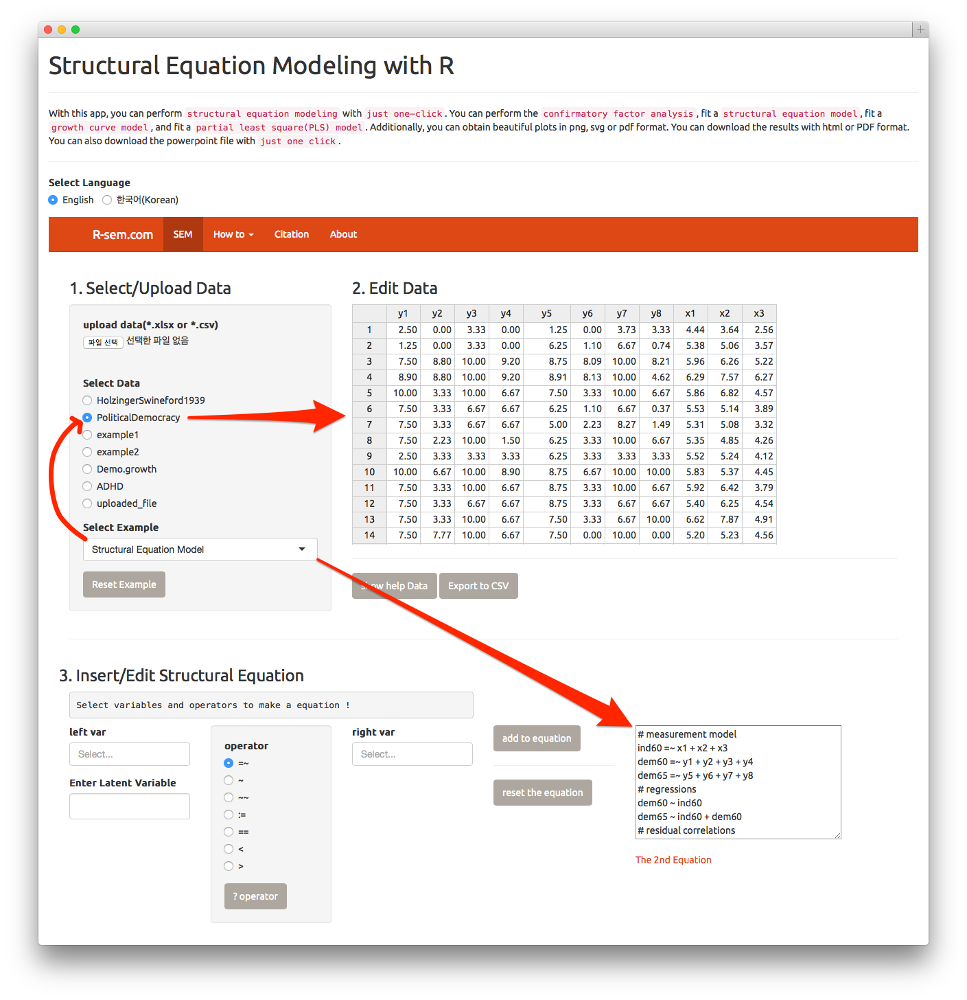
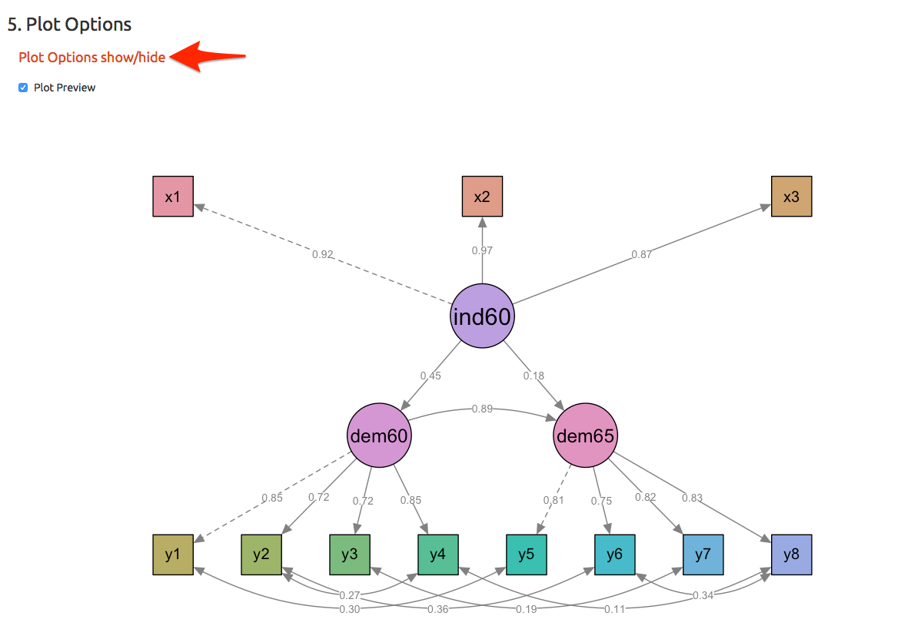
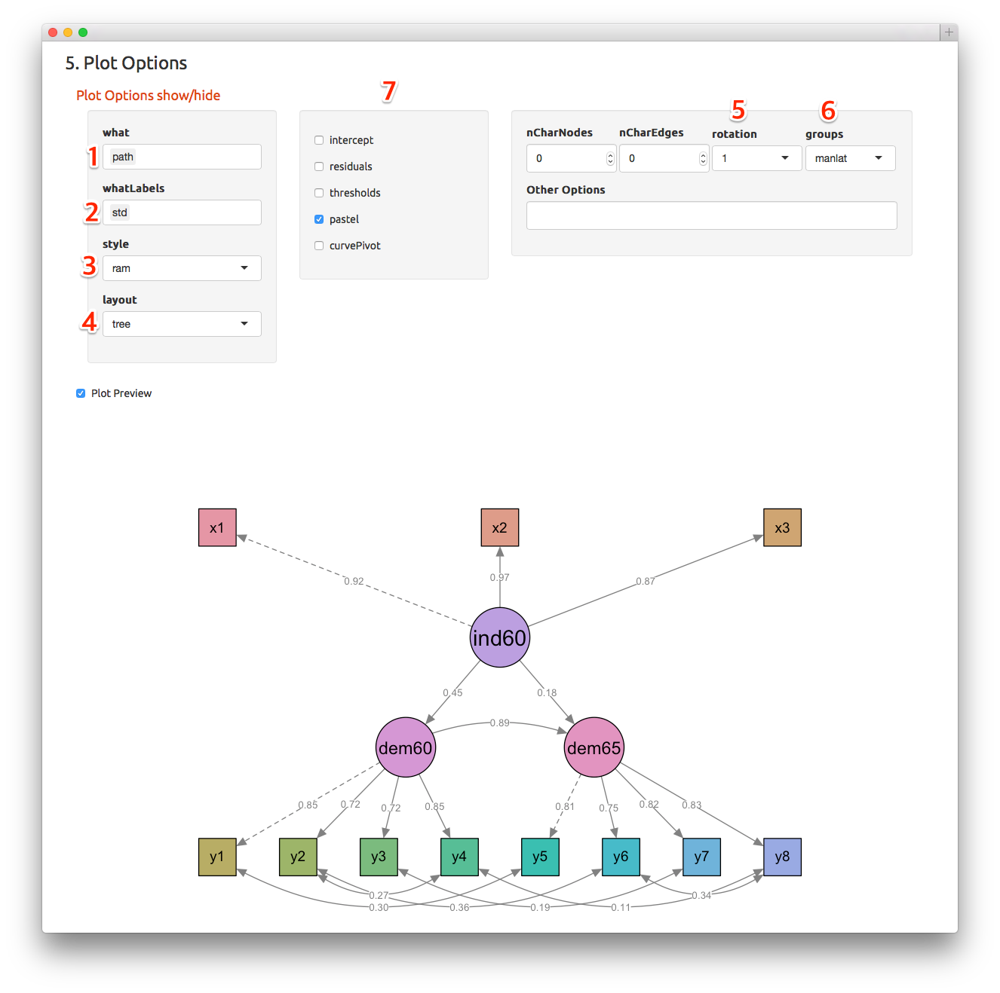
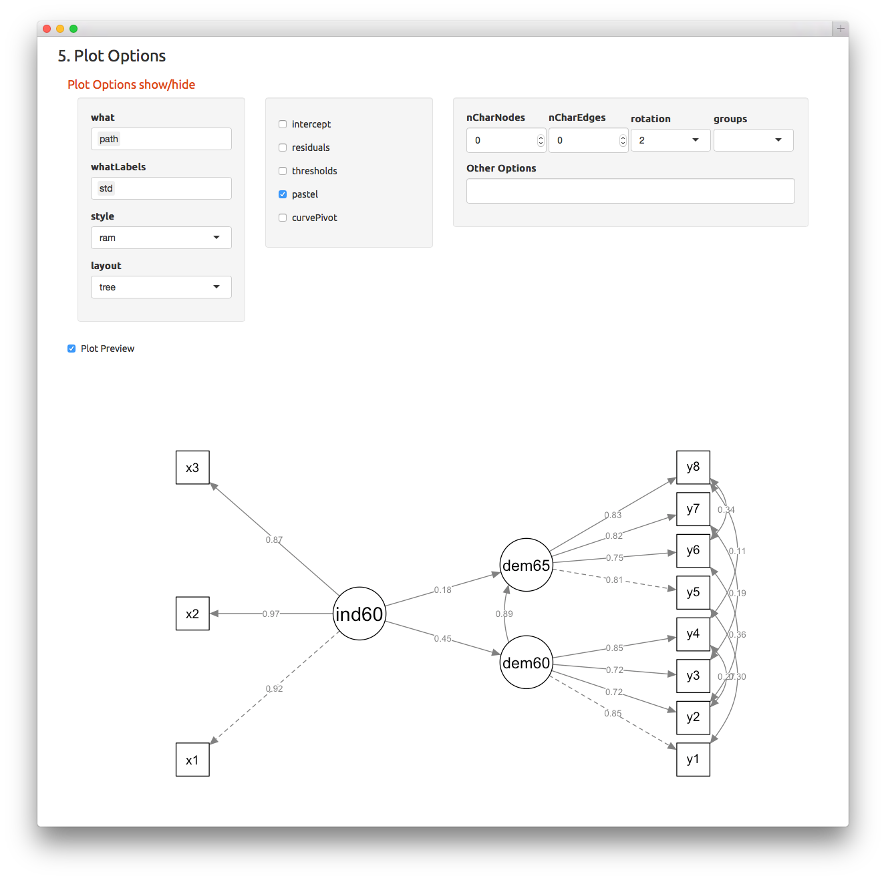
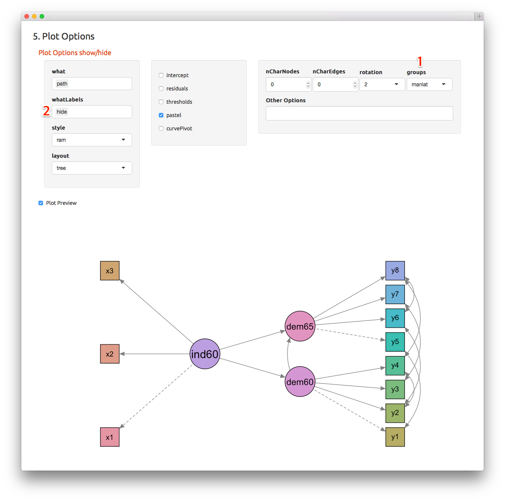
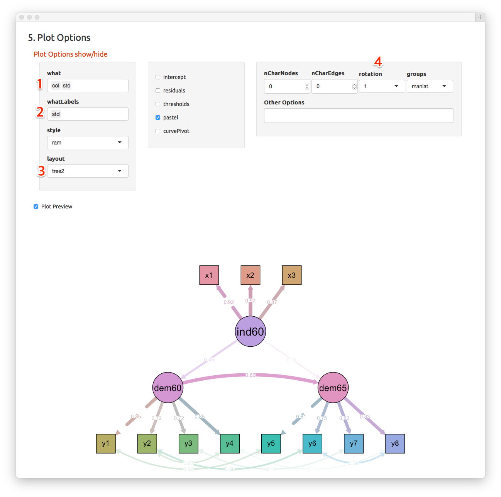

In this chapter, I will show you how to customize your plot. Please select the  `Structural Equation Model` among the `Select Example` selectInput. This selection will set the data to `Political Democracy`(arrow) and make the structural equation as follows(arrow).

```
# measurement model
ind60 =~ x1 + x2 + x3
dem60 =~ y1 + y2 + y3 + y4
dem65 =~ y5 + y6 + y7 + y8
# regressions
dem60 ~ ind60
dem65 ~ ind60 + dem60
# residual correlations
y1 ~~ y5
y2 ~~ y4 + y6
y3 ~~ y7
y4 ~~ y8
y6 ~~ y8
```




# Select Plot Preview

Please Select the `Plot Preview` checkbox. You can see the Plot. To customize your plot, Press the `Plot Options show/hide`(arrow).



In the `Plot Options` window, you can adjust all about the plots.  



If you wanted your plot in black and white, just delete the groups(7) selectInput. To rotate your plot, please select the rotation(6) from 1 to 2. Ratation is an integer indicating the rotation of the layout when "tree" or "tree2" layout is used. 1, 2, 3 and 4 indicate that exogenous variables are placed at the top, left side, bottom and right side respectively. 



Again, select the `manlat` among groups selectInput(1). You can hide your label by select `hide` among wahtLabels selectInput(2). 



You can select `col` among what selectInput and `est` among whatLabels selectInput to label unstandardized estimates.


You can select `std` and `col` among what selectInput(1) and select `std` among whatLabel selectInput(2) to label standardized estimate. In this example, the `tree2` layout was selected(3).



Other possible layouts are circle, spring and circle2. In this example, `circle` layout was selected(1) and `residual` checkbox was selected(3). 


