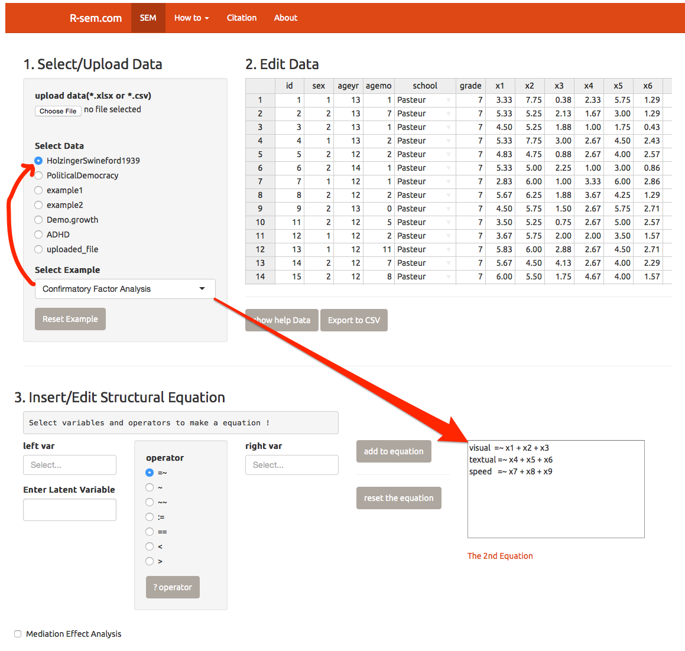
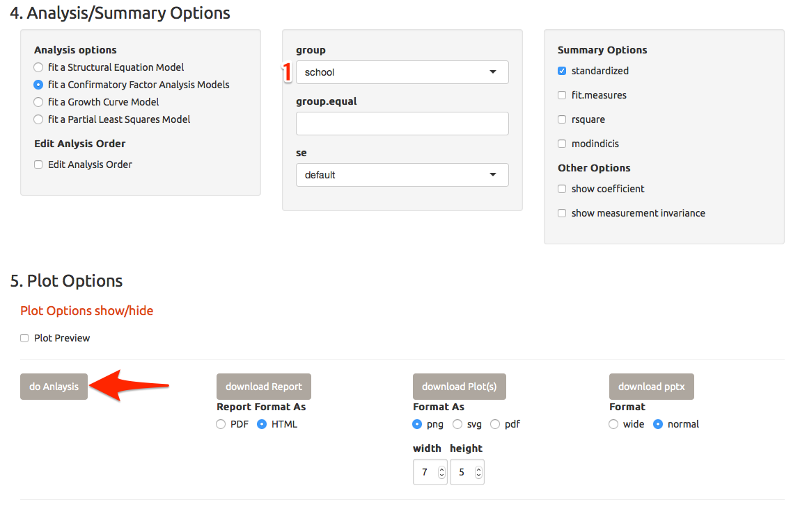
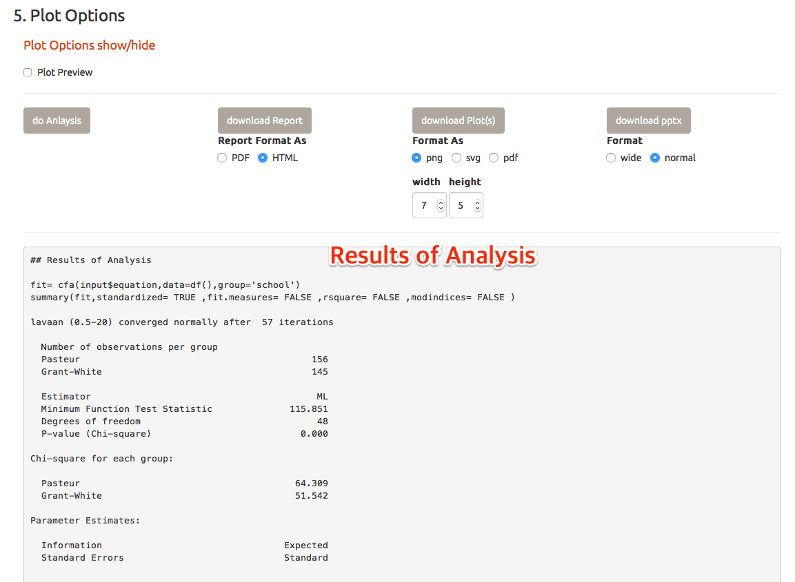
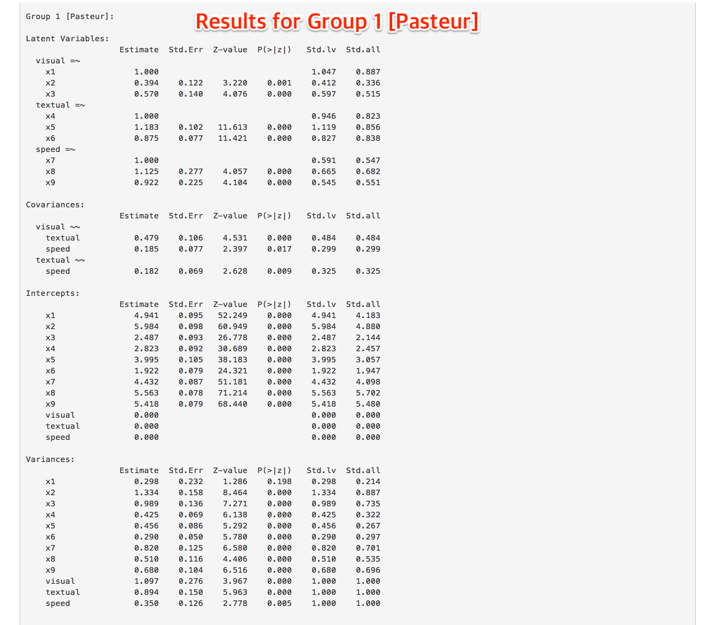
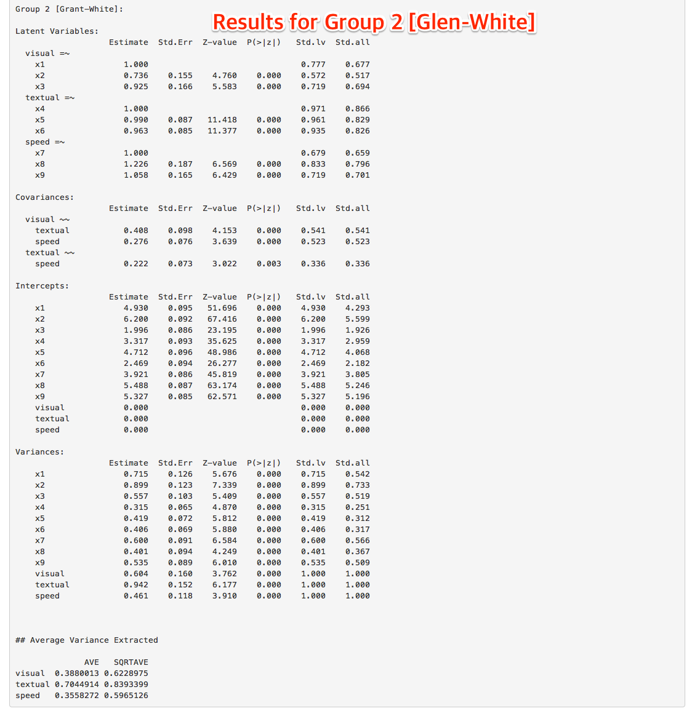
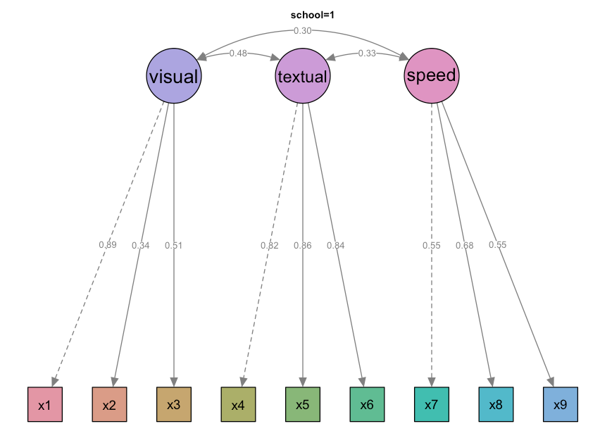
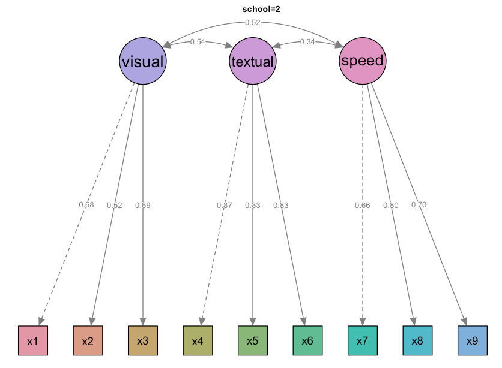
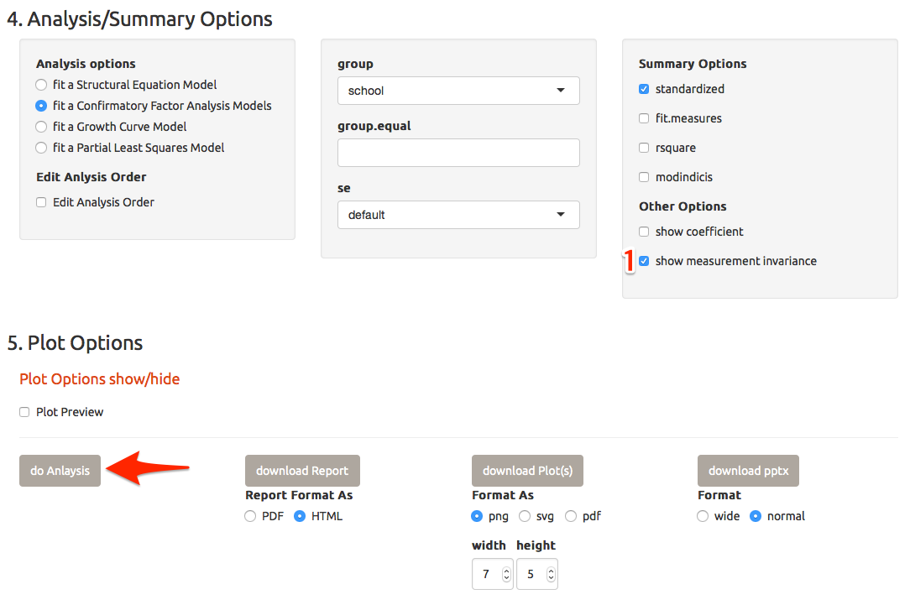
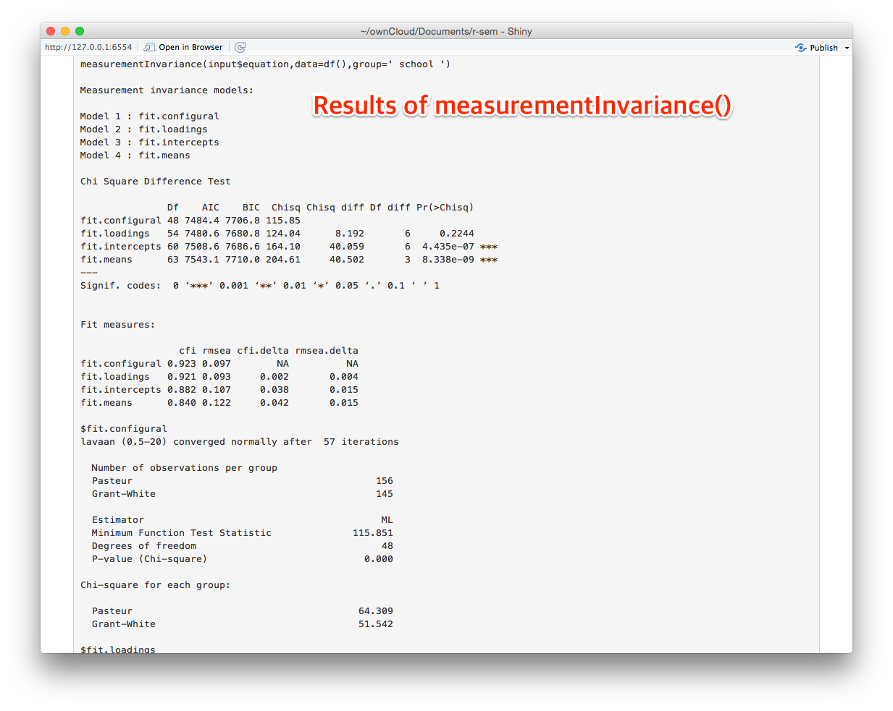
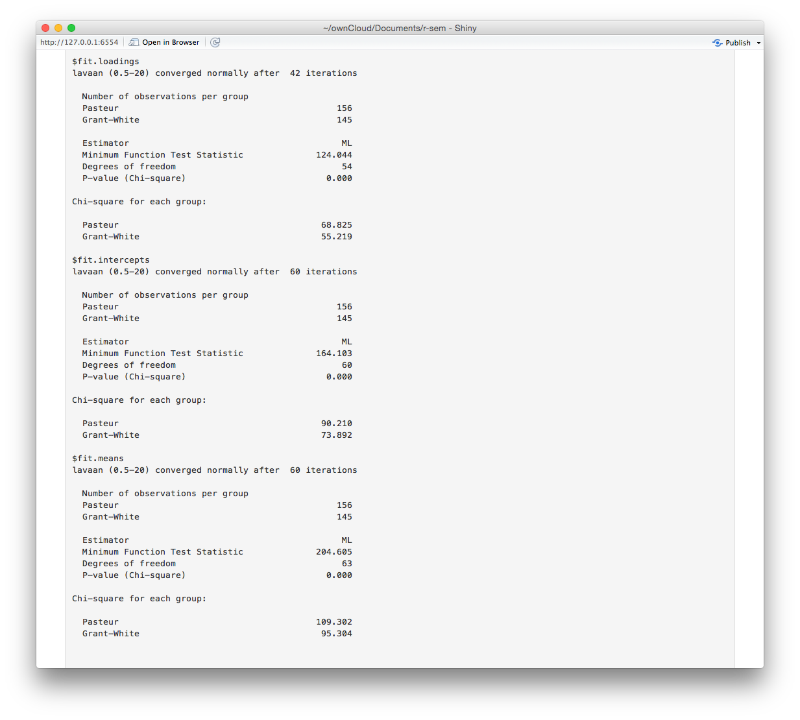

In this chapter, I will show you how to perform multiple group analysis. 

## Select Data and Edit Structural Equation 

Please select the  `Confirmatory Factor Analysis` among the `Select Example` selectInput. This selection will set the data to `HolzingerSwineford1939`(arrow) and make the structural equation as follows(arrow).

```
visual  =~ x1 + x2 + x3 
textual =~ x4 + x5 + x6
speed   =~ x7 + x8 + x9
```



## Select `group` option

Among the Analysis/Summary Options, please select `school` as a group variable(1). Press `do Analysis` button(arrow).




## Results of Analysis(1)

You can get the results of analysis followed by results for group 1 and group 2 seperately.



## Results of Analysis(2)



## Results of Analysis(3)



## Plots for Multiple Groups

You can also get the resultant plots separately(In this example, you will be able to get 2 plots).




## Measurement Invariance

If you are interested in testing the measurement invariance of a CFA model across several groups, select the measurementInvariance checkbox and press the `do Analysis` button. 



You can get the results of measurementInvariance function of semTools package. 




