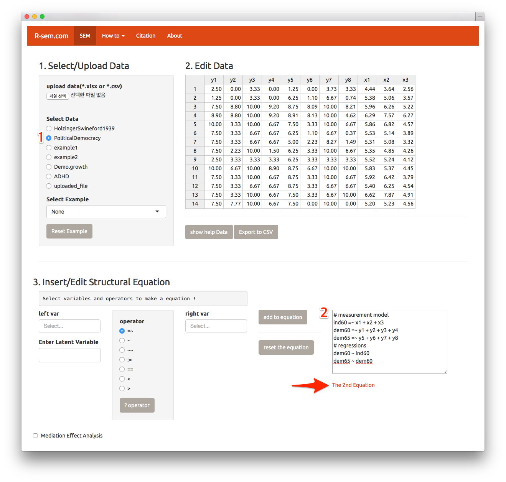
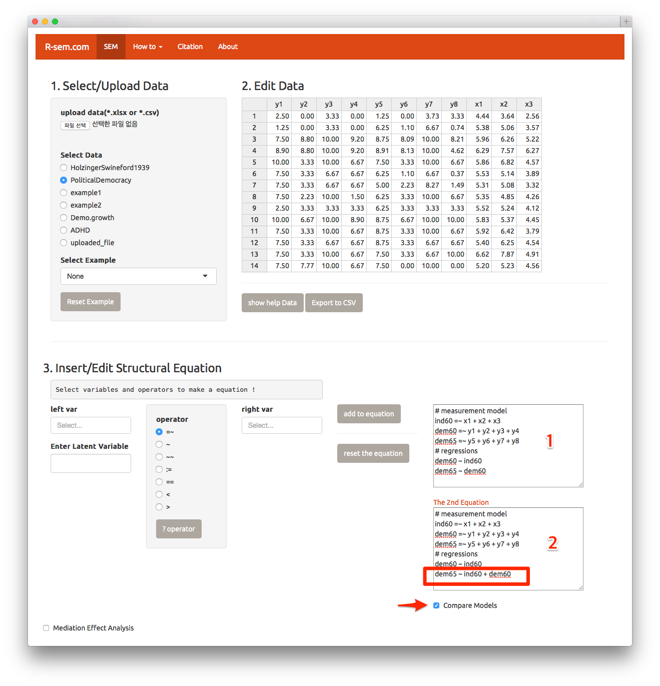
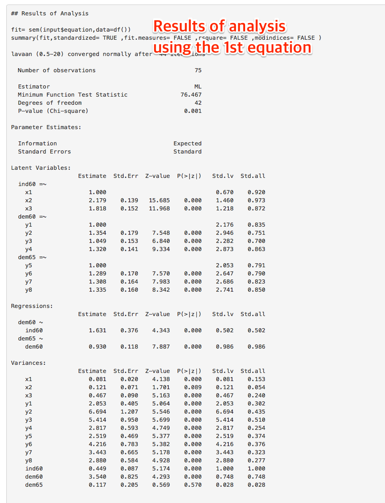
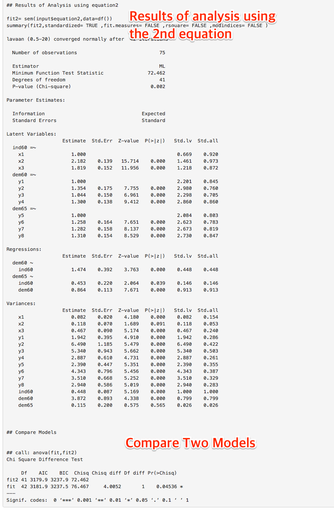
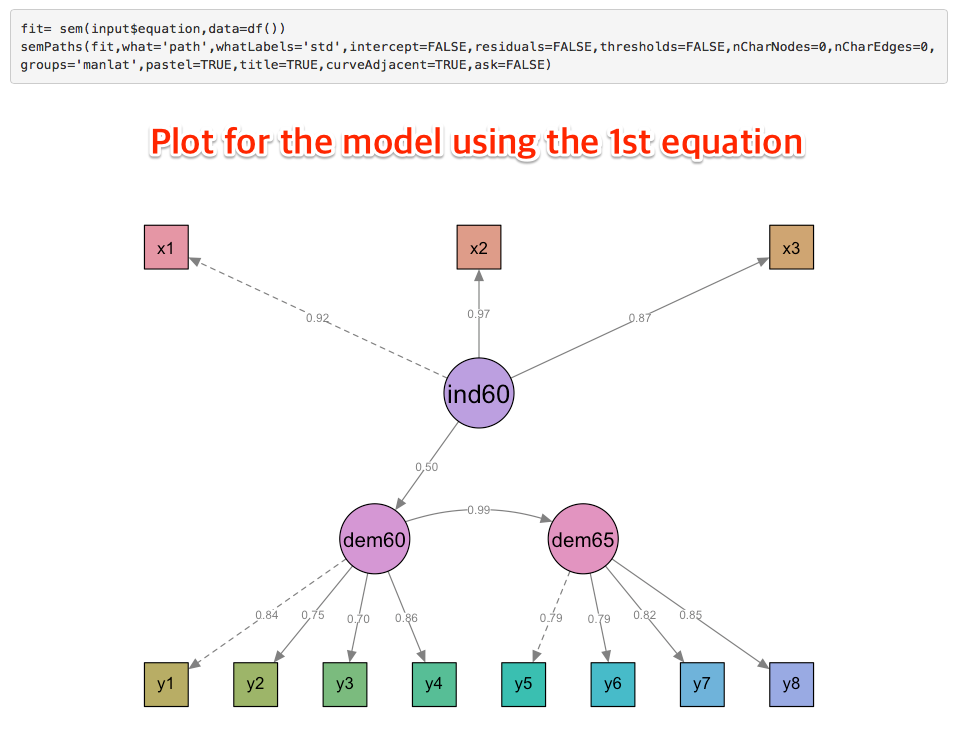
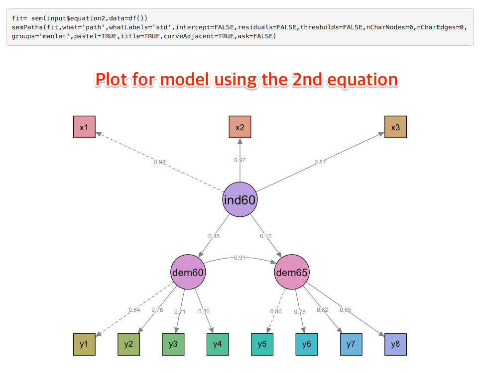

In this chapter, I will show you how to compare two models using different structural equation. 

## Select Data and Edit Structural Equation 

Please select the  `PoliticalDemocracy ` among the `Select Data` radio buttons(1). Make the structural equation as follows(2).

```
# measurement model
ind60 =~ x1 + x2 + x3
dem60 =~ y1 + y2 + y3 + y4
dem65 =~ y5 + y6 + y7 + y8
# regressions
dem60 ~ ind60
dem65 ~dem60
```



Click `The 2nd Equation` text(arrow). 


## Enter the 2nd Equation

Insert the 2nd equation as follows. You can copy the 1st equation(1) and paste it to the 2nd equation(2) and insert `ind60 +` into the last line(box).   

```
# measurement model
ind60 =~ x1 + x2 + x3
dem60 =~ y1 + y2 + y3 + y4
dem65 =~ y5 + y6 + y7 + y8
# regressions
dem60 ~ ind60
dem65 ~ ind60 + dem60
```

Please make sure that the `Compare Models` checkbox in selected(arrow). Press `Do Analysis` button.



## Results of Analysis(1) 

You can get the results of analysis using the 1st equation followed by that using the 2nd equation and result of comparing two models.



## Results of Analysis(2)



## Plots for Two Models





